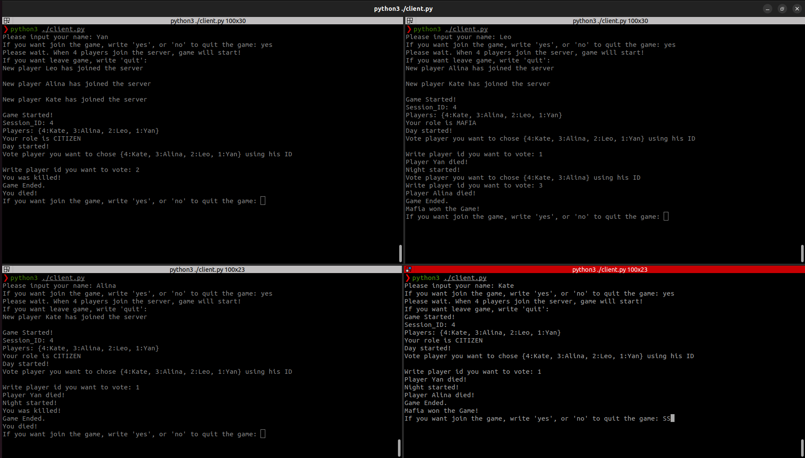

**SOA-mafia**

Игра Мафия, на данный момент поддерживается

Клиент обеспечивает:

1) Автоматический вход в сессию игры, когда набирается
достаточное число игроков


Сервер обеспечивает:
1) Создание одной сессии игры при подключении достаточного
количества игроков
2) Назначение игрокам случайных ролей в соответствии с
требованиями
3) Получение от игроков выбранных действий, их выполнение и
изменение состояния игроков
4) Учет статуса игры и завершение игры при выигрыше мирных
жителей или мафии
5) Возможность ведения нескольких сеансов игры одновременно,
назначая каждому из сеансов уникальный идентификатор.
6) Наличие возможности запускать игрока как бота (добавить опцию -b)

ВАЖНОЕ УТОЧНЕНИЕ:
В первый день игры (то есть первое голосование), чтобы проголосовать необходимо нажать Enter и затем вписать номер ID 
человека, иначе голос не считается. (На данный момент абсолютно не понятно из-за чего возникает такая необходимость, возможно где-то подвисает из-за переключения тредов)

Запустить сервер для брокера сообщений:
```
sudo docker run -it --rm --name rabbitmq -p 5552:5552 -e RABBITMQ_SERVER_ADDITIONAL_ERL_ARGS='-rabbitmq_stream advertised_host localhost' rabbitmq:latest
```

Запустить плагин для rabbitMQ:
```
sudo docker exec rabbitmq rabbitmq-plugins enable rabbitmq_stream
```

Запустить сервер:
```
docker-compose build && docker-compose up
```

Запустить клиента:
```
pip3 install -r requirements.txt && python3 client.py -p 5345
```

Скриншот одной из сессий:

Все игроки управляются вручную. Выиграла Мафия!



**GraphQL**

Чтобы сделать запросы, нужно перейти по адрессу: 0.0.0.0:6345


Пример запроса:
```
query {
  getLiveGames
  getLastGames
  getLiveScoreboard(sessionId:"4") {
    standings {
      sessionId
      players {
        userId
        userName
        isMafia
      }
      result
    }
  }
}
```

Scoreboard обновляется с использованием текущего состояния игр(используя Redis)